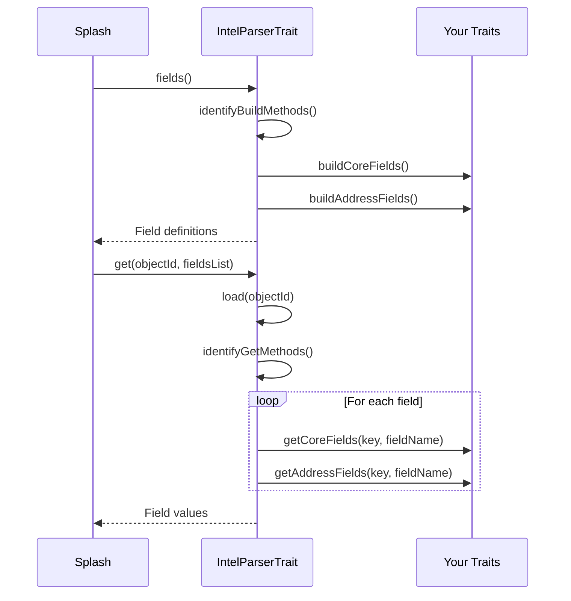

# Advanced Patterns

This document covers advanced techniques for building robust and extensible Splash Objects.

## IntelParserTrait Deep Dive

`IntelParserTrait` auto-discovers methods following naming conventions:

| Method Pattern | Purpose |
|----------------|---------|
| `build*Fields()` | Field definitions (e.g., `buildCoreFields()`, `buildAddressFields()`) |
| `get*Fields()` | Reading fields (e.g., `getCoreFields()`, `getAddressFields()`) |
| `set*Fields()` | Writing fields (e.g., `setCoreFields()`, `setAddressFields()`) |

### How It Works



### Input/Output Buffers

The trait provides `$this->in` and `$this->out` arrays:

```php
// In getter methods: $this->in contains requested field names
protected function getCoreFields(int $key, string $fieldName): void
{
    switch ($fieldName) {
        case "name":
            $this->out[$fieldName] = $this->object->getName();
            unset($this->in[$key]);  // Mark as processed
            break;
    }
}

// In setter methods: $this->in contains field data
protected function setCoreFields(string $fieldName, $fieldData): void
{
    switch ($fieldName) {
        case "name":
            $this->object->setName($fieldData);
            $this->needUpdate();
            unset($this->in[$fieldName]);  // Mark as processed
            break;
    }
}
```

## GenericFieldsTrait

For objects with standard getters/setters, `GenericFieldsTrait` reduces boilerplate:

```php
use Splash\Core\Models\Objects\GenericFieldsTrait;

trait CoreTrait
{
    use GenericFieldsTrait;

    protected function getCoreFields(int $key, string $fieldName): void
    {
        switch ($fieldName) {
            case "name":
            case "email":
            case "phone":
                $this->getGeneric($fieldName);
                unset($this->in[$key]);
                break;
            case "created_at":
                $this->getGenericDateTime($fieldName);
                unset($this->in[$key]);
                break;
            case "is_active":
                $this->getGenericBool($fieldName);
                unset($this->in[$key]);
                break;
        }
    }

    protected function setCoreFields(string $fieldName, $fieldData): void
    {
        switch ($fieldName) {
            case "name":
            case "email":
            case "phone":
                $this->setGeneric($fieldName, $fieldData);
                unset($this->in[$fieldName]);
                break;
            case "created_at":
                $this->setGenericDateTime($fieldName, $fieldData);
                unset($this->in[$fieldName]);
                break;
            case "is_active":
                $this->setGenericBool($fieldName, $fieldData);
                unset($this->in[$fieldName]);
                break;
        }
    }
}
```

### GenericFieldsTrait Methods

| Method | Getter | Setter | Description |
|--------|--------|--------|-------------|
| Generic | `getGeneric()` | `setGeneric()` | Standard string/int fields |
| Bool | `getGenericBool()` | `setGenericBool()` | Boolean fields (uses `is*()` getter) |
| Date | `getGenericDate()` | `setGenericDate()` | Date fields (Y-m-d format) |
| DateTime | `getGenericDateTime()` | `setGenericDateTime()` | DateTime fields (Y-m-d H:i:s) |
| Object | `getGenericObject()` | `setGenericObject()` | Object ID links |

### Method Name Format

Configure how field names map to method names:

```php
// In your Object class
public function __construct()
{
    // For snake_case properties: name => get_name() / set_name()
    self::setGenericMethodsFormat("snake_case");

    // For camelCase (default): name => getName() / setName()
    self::setGenericMethodsFormat("camelCase");

    // For PascalCase: name => GetName() / SetName()
    self::setGenericMethodsFormat("PascalCase");
}
```

## Performance Optimization

### Lazy Loading

Only load related data when needed:

```php
protected function getAddressFields(int $key, string $fieldName): void
{
    //====================================================================//
    // Only load address when address fields are requested
    if (!in_array($fieldName, array("address", "city", "country"))) {
        return;
    }

    //====================================================================//
    // Lazy load address (only once)
    if (!isset($this->address)) {
        $this->address = $this->object->getAddress();
    }

    switch ($fieldName) {
        case "address":
            $this->out[$fieldName] = $this->address?->getStreet();
            unset($this->in[$key]);
            break;
        // ...
    }
}
```

### Batch Operations

For list operations, load all items at once:

```php
public function objectsList(?string $filter = null, array $params = array()): array
{
    //====================================================================//
    // Use optimized query with only needed fields
    $queryBuilder = $this->repository->createQueryBuilder('t')
        ->select('t.id', 't.name', 't.email')  // Only select listed fields
    ;

    // ... pagination, filtering

    return $list;
}
```

### Update Flag

Always use `$this->needUpdate()` to track changes:

```php
protected function setCoreFields(string $fieldName, $fieldData): void
{
    switch ($fieldName) {
        case "name":
            //====================================================================//
            // Compare before setting
            if ($this->object->getName() !== $fieldData) {
                $this->object->setName($fieldData);
                $this->needUpdate();  // Mark as changed
            }
            unset($this->in[$fieldName]);
            break;
    }
}

public function update(bool $needed): ?string
{
    //====================================================================//
    // Skip database write if nothing changed
    if (!$needed) {
        return $this->getObjectIdentifier();
    }

    // ... save to database
}
```

## Related Documentation

- [Extensions & Filters](../03-extensions/index.md) - Extend objects, filter synchronization
- [Helpers Reference](../05-helpers/index.md) - All available helper classes
- [Testing](../06-testing/index.md) - Validate your connector

---

[Back to Documentation Index](../index.md)
