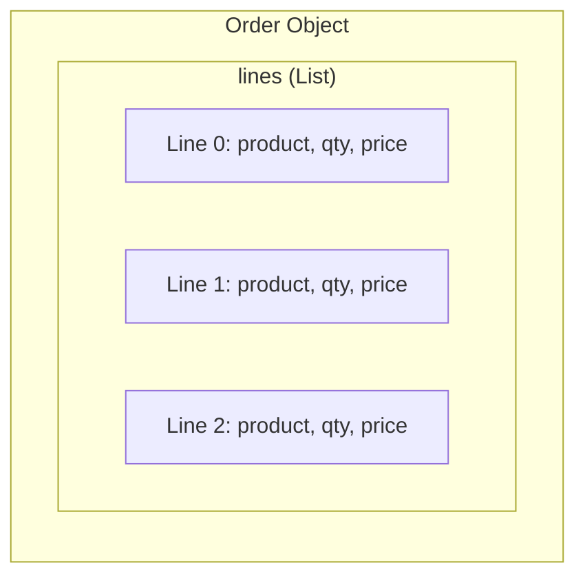

# List Fields

List fields handle collections of data within an object, such as order lines, product images, or contact addresses.

## Concept

A list field groups multiple items under a single name. Each item contains fields defined with `inList()`.



## Defining List Fields

Use `inList()` to assign fields to a list:

```php
<?php

namespace Splash\Local\Objects\Order;

use Splash\Core\Dictionary\SplFields;

trait LinesTrait
{
    /**
     * Build Order Lines Fields
     */
    protected function buildLinesFields(): void
    {
        //====================================================================//
        // Product Reference
        $this->fieldsFactory()->create(SplFields::VARCHAR)
            ->identifier("product")
            ->name("Product SKU")
            ->inList("lines")
            ->isRequired()
        ;

        //====================================================================//
        // Quantity
        $this->fieldsFactory()->create(SplFields::INT)
            ->identifier("quantity")
            ->name("Quantity")
            ->inList("lines")
            ->isRequired()
        ;

        //====================================================================//
        // Unit Price
        $this->fieldsFactory()->create(SplFields::PRICE)
            ->identifier("price")
            ->name("Unit Price")
            ->inList("lines")
        ;

        //====================================================================//
        // Line Description
        $this->fieldsFactory()->create(SplFields::VARCHAR)
            ->identifier("description")
            ->name("Description")
            ->inList("lines")
        ;
    }
}
```

The field identifier becomes `fieldName@listName` (e.g., `quantity@lines`) and type becomes `fieldType@list` (e.g., `int@list`).

## List Data Structure

When reading or writing list data, use arrays indexed by position:

```php
// Data structure for "lines" list
$data["lines"] = array(
    0 => array(
        "product"     => "SKU-001",
        "quantity"    => 2,
        "price"       => array(/* price array */),
        "description" => "Product description",
    ),
    1 => array(
        "product"     => "SKU-002",
        "quantity"    => 1,
        "price"       => array(/* price array */),
        "description" => "Another product",
    ),
);
```

## Reading List Fields

Use `ListsHelper` to build list data:

```php
use Splash\Core\Helpers\ListsHelper;
use Splash\Core\Helpers\PricesHelper;

trait LinesTrait
{
    /**
     * Read Order Lines
     */
    protected function getLinesFields(int $key, string $fieldName): void
    {
        //====================================================================//
        // Check if field belongs to this list
        $listFieldName = ListsHelper::initOutput($this->out, "lines", $fieldName);
        if (!$listFieldName) {
            return;
        }

        //====================================================================//
        // Fill List with Data
        foreach ($this->object->getLines() as $index => $line) {
            $value = null;

            switch ($listFieldName) {
                case "product":
                    $value = $line->getProductSku();
                    break;
                case "quantity":
                    $value = $line->getQuantity();
                    break;
                case "price":
                    $value = PricesHelper::encode(
                        $line->getUnitPrice(),
                        $line->getVatRate(),
                        null,
                        "EUR"
                    );
                    break;
                case "description":
                    $value = $line->getDescription();
                    break;
            }

            //====================================================================//
            // Insert value in list
            ListsHelper::insert($this->out, "lines", $fieldName, $index, $value);
        }

        unset($this->in[$key]);
    }
}
```

### ListsHelper Methods

| Method | Description |
|--------|-------------|
| `initOutput(&$buffer, $listName, $fieldName)` | Initialize list and return field name if it belongs to this list |
| `insert(&$buffer, $listName, $fieldName, $key, $value)` | Insert a value into the list at given index |
| `isList($fieldType)` | Check if a field type is a list field |
| `listName($fieldId)` | Extract list name from field identifier |
| `fieldName($fieldId)` | Extract field name from field identifier |

## Writing List Fields

Process the incoming list data and update your entities:

```php
use Splash\Core\Helpers\ListsHelper;
use Splash\Core\Helpers\PricesHelper;

trait LinesTrait
{
    /**
     * Write Order Lines
     */
    protected function setLinesFields(string $fieldName, $fieldData): void
    {
        //====================================================================//
        // Check if this is the lines list
        if ("lines" !== ListsHelper::listName($fieldName)) {
            return;
        }

        //====================================================================//
        // Verify Data is an Array
        if (!is_array($fieldData)) {
            return;
        }

        //====================================================================//
        // Get current lines
        $currentLines = $this->object->getLines();
        $processedIndexes = array();

        //====================================================================//
        // Process each incoming line
        foreach ($fieldData as $index => $lineData) {
            //====================================================================//
            // Get or create line
            $line = $currentLines[$index] ?? $this->createOrderLine();

            //====================================================================//
            // Update line fields
            if (isset($lineData["product"])) {
                $line->setProductSku($lineData["product"]);
            }
            if (isset($lineData["quantity"])) {
                $line->setQuantity((int) $lineData["quantity"]);
            }
            if (isset($lineData["price"])) {
                $line->setUnitPrice(PricesHelper::taxExcluded($lineData["price"]));
                $line->setVatRate(PricesHelper::taxPercent($lineData["price"]));
            }
            if (isset($lineData["description"])) {
                $line->setDescription($lineData["description"]);
            }

            //====================================================================//
            // Add to order if new
            if (!isset($currentLines[$index])) {
                $this->object->addLine($line);
            }

            $processedIndexes[] = $index;
        }

        //====================================================================//
        // Remove lines that are no longer present
        foreach ($currentLines as $index => $line) {
            if (!in_array($index, $processedIndexes)) {
                $this->object->removeLine($line);
            }
        }

        $this->needUpdate();
        unset($this->in[$fieldName]);
    }

    /**
     * Create a new order line
     */
    private function createOrderLine(): OrderLine
    {
        return new OrderLine();
    }
}
```

## Object ID in Lists

List fields can reference other Splash objects. Use `ObjectsHelper::encode()` to specify the linked object type:

```php
use Splash\Core\Dictionary\SplFields;
use Splash\Core\Helpers\ObjectsHelper;

// Field definition - link to Product objects
$this->fieldsFactory()->create((string) ObjectsHelper::encode("Product", SplFields::ID))
    ->identifier("product_id")
    ->name("Product")
    ->inList("lines")
    ->microData("http://schema.org/Product", "productID")
;

// Reading
$value = ObjectsHelper::encode("Product", (string) $line->getProductId());

// Writing
$productId = ObjectsHelper::id($lineData["product_id"]);
$line->setProductId((int) $productId);
```

## Images in Lists

For product galleries or document attachments:

```php
use Splash\Core\Dictionary\SplFields;
use Splash\Core\Helpers\ImagesHelper;

// Field definition
$this->fieldsFactory()->create(SplFields::IMG)
    ->identifier("image")
    ->name("Image")
    ->inList("images")
;

// Reading
foreach ($this->object->getImages() as $index => $image) {
    $value = ImagesHelper::encode(
        $image->getTitle(),
        $image->getFilename(),
        $image->getPath(),
        $image->getPublicUrl()
    );
    ListsHelper::insert($this->out, "images", $fieldName, $index, $value);
}
```

## Best Practices

1. **Consistent list names**: Use clear, descriptive names (`lines`, `images`, `addresses`)

2. **Handle deletions**: Always remove items that are no longer in the incoming data

3. **Preserve order**: Maintain item order as received from Splash

4. **Use helpers**: Always use `ListsHelper` for consistent data formatting

5. **Mark as required**: Use `isRequired()` for essential list fields

## Next Steps

- [Advanced Patterns](advanced.md) - Extensions, optimization techniques

---

[Back to Documentation Index](../index.md)
