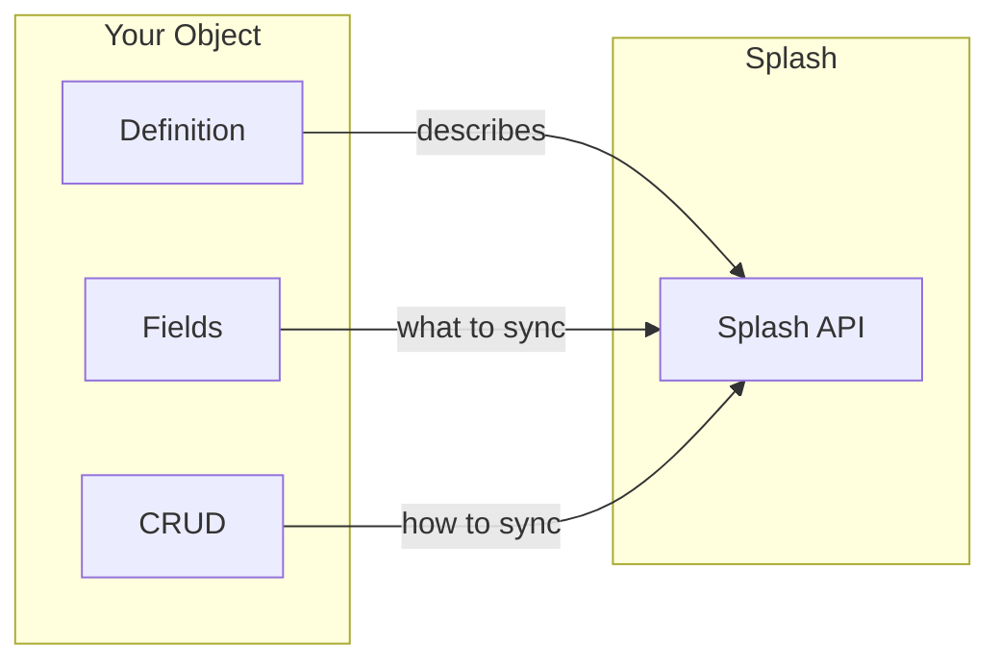
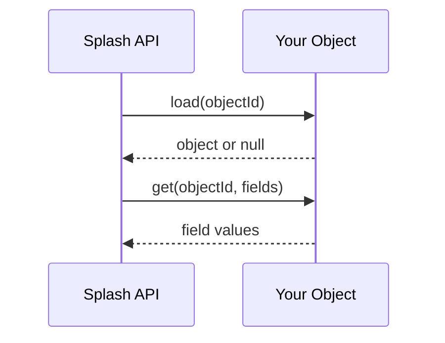
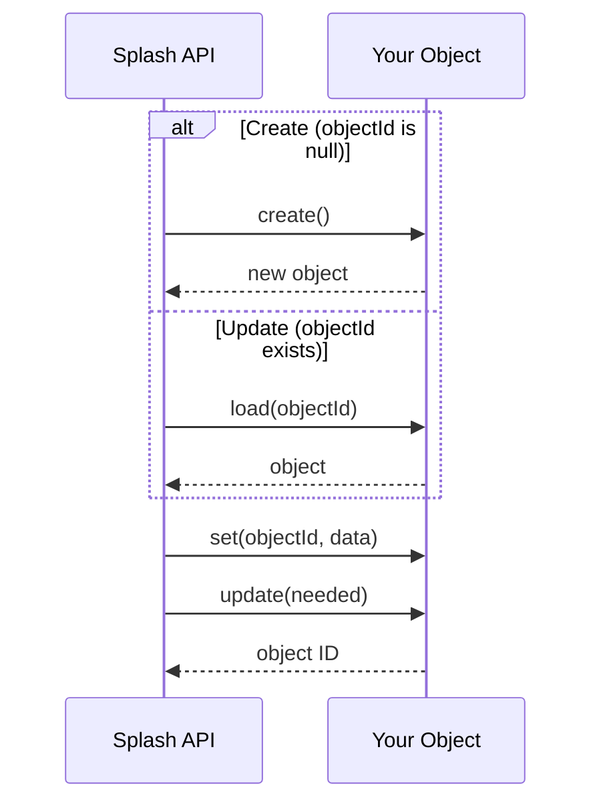
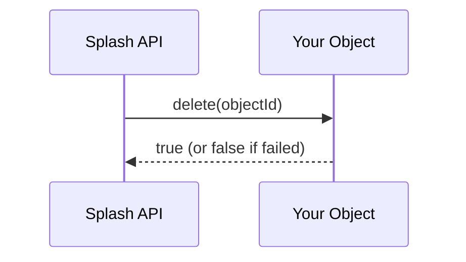

# Objects Overview

Objects are the core of Splash synchronization. Each Object represents a data type in your application (ThirdParty, Product, Order, etc.) that can be synchronized with other systems.

## What is an Object?

An Object is a PHP class that:

- Extends `AbstractObject`
- Defines available **fields** (what data can be synchronized)
- Implements **CRUD operations** (how to read/write data)
- Lives in the `Splash\Local\Objects` namespace



## Minimal Object Structure

**Important**: Using `IntelParserTrait` is **strongly recommended**. It auto-discovers fields and getters/setters, reducing boilerplate code significantly.

```php
<?php

namespace Splash\Local\Objects;

use Splash\Core\Models\AbstractObject;
use Splash\Core\Models\Objects\IntelParserTrait;

class ThirdParty extends AbstractObject
{
    use IntelParserTrait;

    //====================================================================//
    // Object Definition
    //====================================================================//

    /** @var string */
    protected static string $name = "Third Party";

    /** @var string */
    protected static string $description = "Customer or Supplier";

    /** @var string */
    protected static string $ico = "fa fa-user";

    //====================================================================//
    // Object Synchronization Limitations
    //====================================================================//

    /** @var bool Allow creation of new objects */
    protected static bool $allowPushCreated = true;

    /** @var bool Allow update of existing objects */
    protected static bool $allowPushUpdated = true;

    /** @var bool Allow deletion of objects */
    protected static bool $allowPushDeleted = true;

    //====================================================================//
    // Your business object
    //====================================================================//

    protected object $object;

    //====================================================================//
    // CRUD Methods (required)
    //====================================================================//

    public function load(string $objectId): ?object
    {
        // Load and return your business object
    }

    public function create(): ?object
    {
        // Create and return a new business object
    }

    public function update(bool $needed): ?string
    {
        // Save changes and return object ID
    }

    public function delete(?string $objectId = null): bool
    {
        // Delete the object
    }

    public function getObjectIdentifier(): ?string
    {
        // Return current object ID
    }

    public function objectsList(?string $filter = null, array $params = array()): array
    {
        // Return list of objects with pagination
    }
}
```

## Object Definition Properties

### Basic Properties

| Property       | Type     | Description                                |
|----------------|----------|--------------------------------------------|
| `$name`        | `string` | Display name (can be a translation key)    |
| `$description` | `string` | Short description                          |
| `$ico`         | `string` | FontAwesome icon (e.g., `fa fa-user`)      |
| `$disabled`    | `bool`   | Set `true` to disable this object          |

### Synchronization Limitations

These flags **prevent** operations (hard limits):

| Property             | Default | Description                              |
|----------------------|---------|------------------------------------------|
| `$allowPushCreated`  | `true`  | Allow Splash to create new objects       |
| `$allowPushUpdated`  | `true`  | Allow Splash to update existing objects  |
| `$allowPushDeleted`  | `true`  | Allow Splash to delete objects           |

### Synchronization Defaults

These flags set **default configuration** (can be changed by user):

| Property             | Default | Description                                    |
|----------------------|---------|------------------------------------------------|
| `$enablePushCreated` | `true`  | Enable creation when object doesn't exist      |
| `$enablePushUpdated` | `true`  | Enable update when object is modified remotely |
| `$enablePushDeleted` | `true`  | Enable delete when object is deleted remotely  |
| `$enablePullCreated` | `true`  | Enable import of new local objects             |
| `$enablePullUpdated` | `true`  | Enable import of local modifications           |
| `$enablePullDeleted` | `true`  | Enable remote delete when deleted locally      |

## Key Traits

Splash provides traits to simplify Object development:

| Trait                | Purpose                                              |
|----------------------|------------------------------------------------------|
| `IntelParserTrait`   | Auto-discovers fields and getters/setters            |
| `SimpleFieldsTrait`  | Helpers for reading/writing simple fields            |
| `GenericFieldsTrait` | Generic field read/write with type conversion        |
| `LockTrait`          | Object locking (included in AbstractObject)          |
| `TranslatorTrait`    | Translation helpers (included in AbstractObject)     |
| `FieldsFactoryTrait` | Access to FieldsFactory (included in AbstractObject) |

## Object Lifecycle

### Read Operation

When Splash needs to read an object, it first loads it, then requests specific fields.



### Create / Update Operation

For create, `objectId` is `null` and `create()` is called. For update, `load()` is called first. In both cases, `set()` applies the data and `update()` persists changes.

**Performance tip**: The `IntelParserTrait` tracks changes and passes `needed=false` to `update()` if no fields were modified. You can skip the database write in this case for better performance.



### Delete Operation

Simple deletion by object ID. Return `false` only if deletion failed, otherwise `true` (even if object doesn't exist).



## Next Steps

- [Defining Fields](fields.md) - Declare what data can be synchronized
- [CRUD Operations](crud.md) - Implement read/write logic
- [List Fields](lists.md) - Handle array/collection fields
- [Advanced Patterns](advanced.md) - IntelParserTrait, Extensions

---

[Back to Documentation Index](../index.md)
