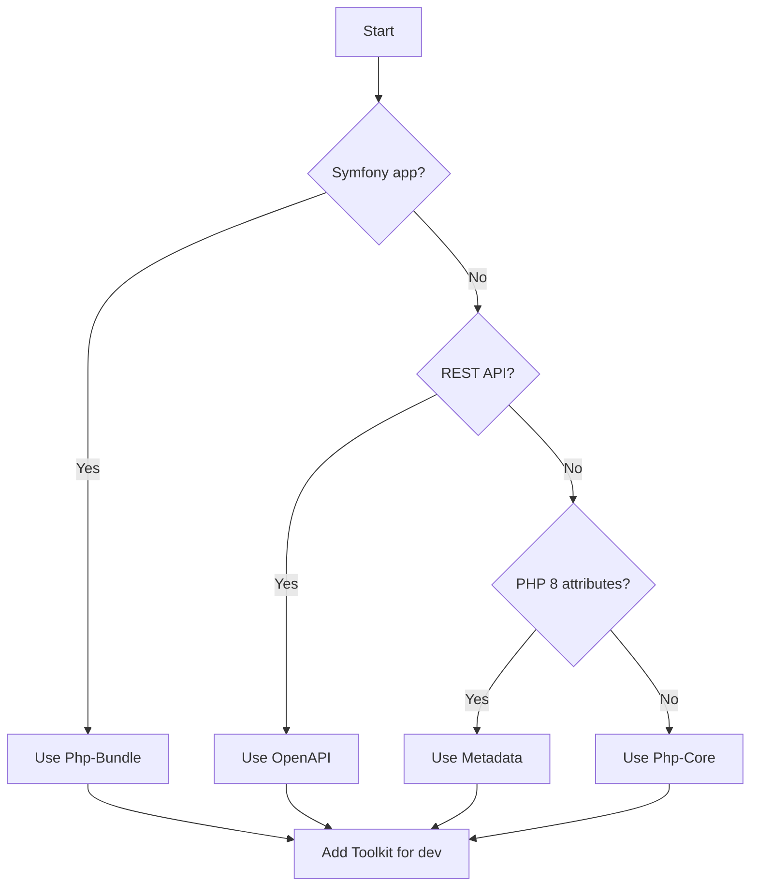
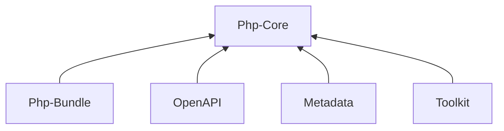

# Ecosystem

Beyond Php-Core, Splash provides higher-level packages for specific use cases.

## Toolkit

**Core development environment** (CLI or Docker). Start here for connector development.

- Complete test framework
- Debug tools and inspectors
- Local development server

| Link | URL |
|------|-----|
| GitLab | https://gitlab.com/SplashTools/Toolkit |
| Packagist | https://packagist.org/packages/splash/toolkit |

```bash
composer require splash/toolkit --dev
```

## Php-Bundle

**Complete Symfony integration**. Offers more possibilities for Symfony-based applications.

- Symfony service integration
- Doctrine ORM helpers
- Event system integration
- Console commands

| Link | URL |
|------|-----|
| GitHub | https://github.com/SplashSync/Php-Bundle |
| Packagist | https://packagist.org/packages/splash/php-bundle |

```bash
composer require splash/php-bundle
```

## OpenAPI

**Connect to any REST API** using OpenAPI specs. Auto-generates Objects from API schemas.

- OpenAPI/Swagger specification support
- Automatic object generation
- REST client integration

| Link | URL |
|------|-----|
| GitLab | https://gitlab.com/SplashTools/OpenApi |
| Packagist | https://packagist.org/packages/splash/openapi |

```bash
composer require splash/openapi
```

## Metadata

**Define field access from PHP 8 attributes**. Also supports Doctrine attributes.

- PHP 8 attribute-based field definitions
- Doctrine entity integration
- Automatic getter/setter mapping

| Link | URL |
|------|-----|
| GitLab | https://gitlab.com/SplashTools/Metadata |
| Packagist | https://packagist.org/packages/splash/metadata |

```bash
composer require splash/metadata
```

## Choosing the Right Package



| Scenario | Recommended Package |
|----------|---------------------|
| Symfony application | Php-Bundle + Toolkit |
| REST API connector | OpenAPI + Toolkit |
| Modern PHP 8 app | Metadata + Toolkit |
| Custom integration | Php-Core + Toolkit |

## Package Dependencies



All packages depend on Php-Core, which provides the foundation for building connectors.

---

[Back to Documentation Index](../index.md)
