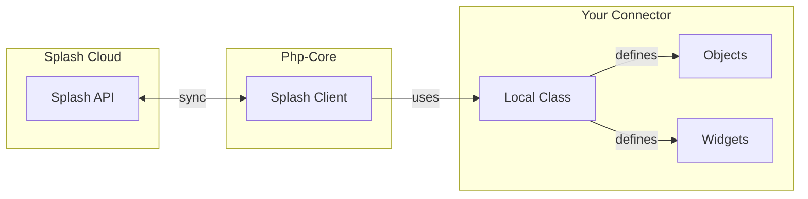
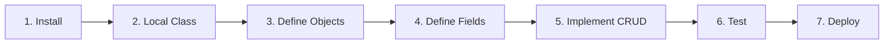

# Splash Php-Core Documentation

Core library for building Splash Sync connectors. Provides base classes, interfaces, and field system for synchronizing data between applications.

## What is Splash Sync?

Splash Sync is a universal data synchronization framework. Connectors built with this library can exchange data (Products, Orders, Customers, etc.) between any application and the Splash ecosystem.

## Architecture Overview

The **Local Class** is your connector's entry point. It provides configuration and declares which Objects and Widgets are available. The Splash Client handles all communication with the Splash API.

## Connector Development Flow

1. **Install** - Add `splash/phpcore` via Composer
2. **Local Class** - Implement `LocalClassInterface` with credentials
3. **Define Objects** - Create classes extending `AbstractObject`
4. **Define Fields** - Use `FieldsFactory` to declare available fields
5. **Implement CRUD** - Code `get()`, `set()`, `delete()`, `objectsList()`
6. **Test** - Validate with built-in test framework
7. **Deploy** - Your connector is ready

## Ecosystem

Beyond this core library, Splash provides higher-level packages for specific use cases.

| Package | Use Case | Links |
|---------|----------|-------|
| **Toolkit** | Core development environment (CLI or Docker). Includes everything to develop, debug, and test connectors locally. Start here. | [GitLab](https://gitlab.com/SplashTools/Toolkit) · [Packagist](https://packagist.org/packages/splash/toolkit) |
| **Php-Bundle** | Complete Symfony integration. Offers even more possibilities for Symfony-based applications. | [GitHub](https://github.com/SplashSync/Php-Bundle) · [Packagist](https://packagist.org/packages/splash/php-bundle) |
| **OpenAPI** | Connect to any REST API using OpenAPI specs. Auto-generates Objects from API schemas. | [GitLab](https://gitlab.com/SplashTools/OpenApi) · [Packagist](https://packagist.org/packages/splash/openapi) |
| **Metadata** | Define field access directly from object properties using PHP 8 attributes. Also supports Doctrine attributes. | [GitLab](https://gitlab.com/SplashTools/Metadata) · [Packagist](https://packagist.org/packages/splash/metadata) |

## Documentation Map

### Getting Started

| Document | Description |
|----------|-------------|
| [Installation](01-getting-started/installation.md) | Install the library and requirements |
| [Local Class](01-getting-started/local-class.md) | Configure your connector entry point |

### Building Objects

| Document | Description |
|----------|-------------|
| [Objects Overview](02-objects/overview.md) | What are Objects and how they work |
| [Defining Fields](02-objects/fields.md) | Create field definitions with FieldsFactory |
| [Complex Fields](02-objects/fields-complex.md) | Price, Image, File, ObjectId fields |
| [CRUD Operations](02-objects/crud.md) | Implement get, set, delete, objectsList |
| [List Fields](02-objects/lists.md) | Handle array/collection fields |
| [Advanced Patterns](02-objects/advanced.md) | IntelParserTrait, optimization |

### Extensions & Filters

| Document | Description |
|----------|-------------|
| [Extensions & Filters](03-extensions/index.md) | Extend objects, filter synchronization |

### Widgets & Helpers

| Document | Description |
|----------|-------------|
| [Widgets](04-widgets/overview.md) | Build dashboard widgets |
| [Helpers Reference](05-helpers/index.md) | PricesHelper, ObjectsHelper, DatesHelper, etc. |

### Testing & Ecosystem

| Document | Description |
|----------|-------------|
| [Testing](06-testing/index.md) | Validate your connector |
| [Ecosystem](07-ecosystem/index.md) | Related packages: php-bundle, openapi, metadata, toolkit |

## Quick Reference

### Key Classes

| Class | Purpose |
|-------|---------|
| `Splash\Client\Splash` | Main static facade - entry point for all operations |
| `Splash\Models\AbstractObject` | Base class for all Objects |
| `Splash\Models\AbstractWidget` | Base class for all Widgets |
| `Splash\Components\FieldsFactory` | Fluent API for field definitions |

### Key Interfaces

| Interface | Implement When |
|-----------|---------------|
| `LocalClassInterface` | Always - your connector entry point |
| `ObjectInterface` | Creating sync objects (use AbstractObject instead) |
| `WidgetInterface` | Creating dashboard widgets (use AbstractWidget instead) |